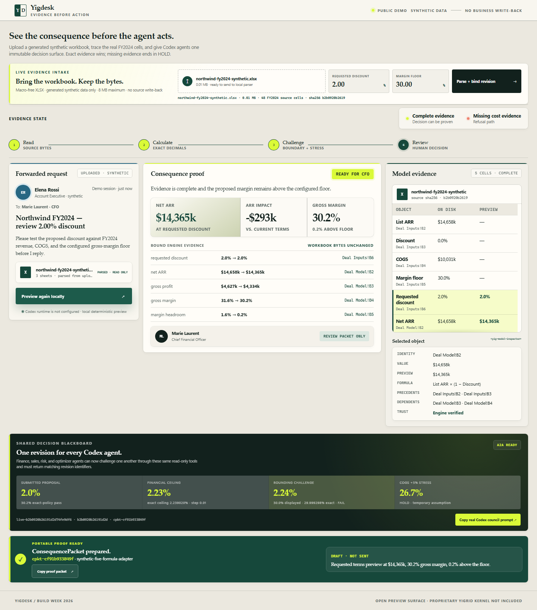

# Yigdesk

**See the consequence before the agent acts.**

Yigdesk is a read-only decision blackboard built with Codex for OpenAI Build Week.
Upload a generated synthetic FY2024 workbook; Yigdesk parses its real P&L cells,
binds them to one immutable source fingerprint, previews discount consequences,
and gives Codex subagents deterministic tools for proposal challenge. If evidence
is missing—or exact margin fails despite safe-looking display rounding—the result
is an honest <code>HOLD</code>.

## The 2-minute demo

1. Start `python -m yigdesk.app`, open <http://127.0.0.1:8787>, and upload the
   generated FY2024 synthetic XLSX with a **2.00%** request and **30.00%** floor.
2. The browser parses the real bytes and creates the same immutable session used by
   Codex Work. Show the filename, source-cell count, SHA-256 fingerprint, extracted
   revenue and COGS, and unchanged-source proof.
3. In the repository's Codex task ask: `Use $yigdesk-council on the current bound
   revision.` The same task runs the real specialist council; the browser's four role
   counters follow its actor-attributed MCP audit rather than simulated dialogue.
4. Its deterministic base analysis is
   <code>READY FOR CFO</code>, net ARR <code>$14,365k</code>, ARR impact
   <code>-$293k</code>, gross margin <code>30.2%</code>, and <code>0.2%</code> headroom.
5. Show the returned decision brief: requested **2.00%** passes, the exact ceiling is
   **2.239020%**, **2.23%** is the largest safe 0.01-point proposal, and **2.24%**
   displays **30.0%** while failing the exact constraint.
6. Show `A2A VERIFIED`: finance, sales, and risk called the same Yigdesk
   revision; `decision_optimizer` ran only after the revision gate passed.
7. Show terminal <code>HOLD</code> with missing cost evidence. No
   approval, send, messaging, or business write-back endpoint exists.

See the [natural-language demo guide](docs/NATURAL_LANGUAGE_DEMO.md) for the exact
one-request script and follow-ups.

The bundled scenario is synthetic. The fixed adapter evaluates:

~~~text
net ARR       = 1000 * (1 - 12%) = 880
ARR impact    = 880 - 900        = -20
gross profit  = 880 - 480        = 400
gross margin  = 400 / 880        = 45.5%
headroom      = 45.5% - 40%      = 5.5 points
~~~

## Run locally

Requirements: Python 3.11+ and Node.js 20+. Local deterministic preview needs no
OpenAI credential. The primary agent flow runs in the repository's authenticated
Codex Work task and calls the project Yigdesk MCP directly.

~~~bash
python -m pip install -r requirements.txt
npm ci
python -m yigdesk.app
~~~

Generate a small public upload sample if you do not have the larger synthetic
lift packet:

~~~bash
python -m scripts.generate_sample_workbook
~~~

Open <http://127.0.0.1:8787>. Upload
`runtime/northwind-fy2024-synthetic.xlsx`, or use a built-in refusal fixture.
With Codex disabled, the button is explicitly
labeled **Preview consequence locally** and all data plus the five-formula
adapter remain local and synthetic.

The browser does not need to spawn a second Codex process. After upload, remain in
the repository's Codex task and say:

~~~text
Use $yigdesk-council on the current bound Yigdesk revision. Run the real challenged
council and return only an audit-verified recommendation.
~~~

For controlled compatibility testing only, an optional nested single-agent harness
can be enabled in PowerShell:

~~~powershell
$env:YIGDESK_NESTED_CODEX_ENABLED = "1"
$env:YIGDESK_CODEX_MODEL = "gpt-5.6-sol"
$env:YIGDESK_CODEX_REASONING_EFFORT = "low"
python -m yigdesk.app
~~~

The button is labeled **Analyze with nested Codex** only in this opt-in mode. It uses
standard service tier (no Fast), a 120-second server budget, low reasoning, low
verbosity, no reasoning summary, the repository's native Codex binary when available,
and only the three required MCP tools. The verified single-agent proof path must call
<code>get_deal_context</code>, <code>preview_consequence</code>, and
<code>inspect_evidence</code>. Yigdesk rejects the answer if the audited tool
trace, packet ID, verdict, evidence address, or any displayed figure drifts from
the deterministic packet. There is no silent fallback.

CLI:

~~~bash
python -m yigdesk.cli bind --file runtime/northwind-fy2024-synthetic.xlsx --discount 2 --floor 30
python -m yigdesk.cli state
python -m yigdesk.cli analyze
python -m yigdesk.cli inspect "Deal Model!B4"
python -m yigdesk.cli reset --scenario hold
~~~

MCP server, for direct Inspector or client testing:

~~~bash
python -m yigdesk.mcp_server
~~~

## Real Codex A2A council

Open this repository in a Codex task. Either attach/reference a generated synthetic
workbook, or upload it in the browser first and ask the Skill to reuse the current
bound revision. Project configuration connects the local Yigdesk MCP server,
`.codex/agents/` defines four read-only roles, and the project Skill owns intake,
service readiness, orchestration, and verification. Ask:

~~~text
使用 $yigdesk-council 分析我附上的 Northwind FY2024 合成 Excel。
当前折扣 0%，客户申请 2%，毛利率底线 30%。
让 finance、sales、risk 真实调用 Yigdesk 相互 challenge，最后给我审计通过的建议。
~~~

This is a real Codex subagent workflow. Yigdesk does not draw fake agent chat in
the browser; it exposes eight read-only MCP tools that every role can call:
context, consequence, evidence inspection, proposal evaluation, proposal
comparison, exact boundary, explicit COGS stress test, and missing-evidence
listing. See [A2A decision protocol](docs/A2A_DECISION_PROTOCOL.md).

Every council role passes an allowlisted actor on each call. Yigdesk records a
session-specific, ignored audit under `runtime/sessions/`; the actor is audit attribution, not
an authentication credential. Independently verify the latest run:

~~~bash
npm run verify:a2a
~~~

## Private A/B comparison

Copy <code>benchmarks/case-template.json</code> into the ignored
<code>benchmarks/private/</code> directory and replace it with an independently
verified case plus gold result. Then run the same Codex model bare and with
Yigdesk assistance:

~~~bash
python -m scripts.compare_agents \
  --case benchmarks/private/case.json \
  --runs 3 \
  --reasoning-effort low \
  --acknowledge-data-sharing
~~~

Both modes send the supplied request and inputs to OpenAI, so the acknowledgement
is mandatory. Reports are written under ignored <code>benchmark-results/</code>
and contain only case ID, verdict/metrics, latency, token usage, proof hashes, and
tool names. They exclude the email body and raw inputs. Private case content is
streamed to bare Codex over stdin and is never placed in process arguments.

Accuracy uses decimal values plus field-specific units, so <code>$880k</code> and
<code>$880.0k</code>, or <code>5.5%</code> and <code>5.50 percentage points</code>,
are semantically equivalent. Exact display-format consistency is reported
separately. Bare Codex receives the same intermediate rounding contract as the
reference engine: money intermediates use <code>0.01k / ROUND_HALF_UP</code>, while
margin and headroom use <code>0.1 percentage point / ROUND_HALF_UP</code>. Semantic
scoring then normalizes high-precision answers to the final display resolution:
whole thousands with <code>ROUND_HALF_EVEN</code> and percentage points to one
decimal with <code>ROUND_HALF_UP</code>. The JSON report embeds this contract.

The report also shows the deterministic engine result versus the independent
gold, and records individual trial failures plus failure rate instead of
discarding an otherwise usable comparison. Three paired runs remain supported
for a small demo. Because an odd count leaves one extra AB position, use the
default four runs (or another even count) for fully balanced order. The harness
always alternates AB/BA and rejects a model or reasoning-effort mismatch between
modes.

Tests:

~~~bash
python -m pytest
npx playwright install chromium
npm run test:e2e
~~~

Authenticated real-browser Council performance E2E (PowerShell):

~~~powershell
$env:YIGDESK_REAL_COUNCIL = "1"
npm run test:council-real
~~~

This uploads the generated synthetic workbook in Playwright and requires the real
15-call Council, candidate-schema check, revision gate, and audit verification to
finish within the 120-second process budget. It uses `gpt-5.6-terra` on standard
service tier with Fast disabled.

## What is open here

This repository is a deliberately narrow adoption surface:

- a domain-neutral read-only <code>YigdeskSession</code> interface;
- <code>&lt;yig-grid&gt;</code> and <code>&lt;yig-model-inspector&gt;</code> web components;
- the Yigdesk experience and synthetic finance fixture;
- a scenario-specific five-formula adapter and consequence-packet demo;
- strict synthetic XLSX intake with source fingerprint and cell-level provenance;
- an eight-tool, revision-bound MCP decision surface and project Codex agents;
- tests, container setup, and Build Week materials.

It does **not** contain the proprietary Yigrid kernel, general DAG semantics, operational history, governance/authorization, persistent write-back, vault, signing, transparency log, compliance, SSO, or multi-tenant services. The public packet is a demo protocol, not a Yigrid production attestation.

See [Open-core boundary](docs/OPEN_CORE_BOUNDARY.md), [Architecture](docs/ARCHITECTURE.md), and the [Evidence Ledger design system](docs/DESIGN_SYSTEM.md).

## How Codex shaped the build

Codex was used as the primary engineering agent to narrow the office workflow, implement the full-stack demo, challenge the read-only and refusal claims, add the live incomplete-evidence path, polish the product surface, and drive Python plus browser acceptance tests. The important product decision was to make evidence visible before any action rather than asking users to trust an agent's prose.

The project targets the **Work & Productivity** category. The runtime contains
a real Codex tool-use path in addition to Codex being the primary engineering
agent, plus project-scoped custom subagents for A2A challenge. See the
[Build Week submission checklist](docs/BUILD_WEEK_SUBMISSION.md) for the public
video, repository, sample-data, setup, and `/feedback` handoff requirements.

## License and rights

Files in this repository are licensed under Apache-2.0. That license applies only to this repository and grants no right to Yigrid proprietary source code, services, data, or trademarks. “Yigrid” and “Yigdesk” are product identifiers; see [NOTICE](NOTICE).

All people, organizations, messages, values, and workbook contents are fictional and synthetic.
