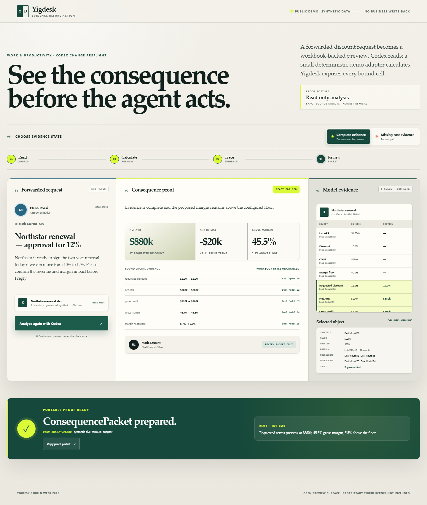

# Yigdesk

**See the consequence before the agent acts.**

Yigdesk is a polished, read-only office-agent demo built with Codex for OpenAI Build Week. A synthetic discount request arrives by email; Yigdesk reads its generated workbook, previews ARR and margin consequences, and shows the five exact cells behind the result. If cost evidence is missing, it returns an honest <code>HOLD</code>.

## The 90-second demo

1. Open the complete-evidence scenario and select **Analyze with Codex**.
2. See <code>READY FOR CFO</code>, net ARR <code>$880k</code>, ARR impact <code>-$20k</code>, gross margin <code>45.5%</code>, and <code>5.5%</code> headroom.
3. Inspect the highlighted workbook objects and their precedents/dependents.
4. Switch to **Missing cost evidence** and rerun. Margin becomes <code>Unavailable</code> and the verdict becomes <code>HOLD</code>.
5. Notice the source fingerprint and <code>Workbook bytes unchanged</code> proof. There is no business write-back endpoint in this public build.

The bundled scenario is synthetic. The fixed adapter evaluates:

~~~text
net ARR       = 1000 * (1 - 12%) = 880
ARR impact    = 880 - 900        = -20
gross profit  = 880 - 480        = 400
gross margin  = 400 / 880        = 45.5%
headroom      = 45.5% - 40%      = 5.5 points
~~~

## Run locally

Requirements: Python 3.11+ and Node.js 20+.

~~~bash
python -m pip install -r requirements.txt
npm ci
python -m yigdesk.app
~~~

Open <http://127.0.0.1:8787>. No API key is required because all data and the five-formula preview adapter are local and synthetic.

CLI:

~~~bash
python -m yigdesk.cli state
python -m yigdesk.cli analyze
python -m yigdesk.cli inspect "Deal Model!B4"
python -m yigdesk.cli reset --scenario hold
~~~

Tests:

~~~bash
python -m pytest
npx playwright install chromium
npm run test:e2e
~~~

## What is open here

This repository is a deliberately narrow adoption surface:

- a domain-neutral read-only <code>YigdeskSession</code> interface;
- <code>&lt;yig-grid&gt;</code> and <code>&lt;yig-model-inspector&gt;</code> web components;
- the Yigdesk experience and synthetic finance fixture;
- a scenario-specific five-formula adapter and consequence-packet demo;
- tests, container setup, and Build Week materials.

It does **not** contain the proprietary Yigrid kernel, general DAG semantics, operational history, governance/authorization, persistent write-back, vault, signing, transparency log, compliance, SSO, or multi-tenant services. The public packet is a demo protocol, not a Yigrid production attestation.

See [Open-core boundary](docs/OPEN_CORE_BOUNDARY.md), [Architecture](docs/ARCHITECTURE.md), and the [Evidence Ledger design system](docs/DESIGN_SYSTEM.md).

## How Codex shaped the build

Codex was used as the primary engineering agent to narrow the office workflow, implement the full-stack demo, challenge the read-only and refusal claims, add the live incomplete-evidence path, polish the product surface, and drive Python plus browser acceptance tests. The important product decision was to make evidence visible before any action rather than asking users to trust an agent's prose.

The project targets the **Work & Productivity** category. The official submission requires a working project, description, sub-three-minute public demo video, testable repository, and the primary Codex <code>/feedback</code> session ID.

## License and rights

Files in this repository are licensed under Apache-2.0. That license applies only to this repository and grants no right to Yigrid proprietary source code, services, data, or trademarks. “Yigrid” and “Yigdesk” are product identifiers; see [NOTICE](NOTICE).

All people, organizations, messages, values, and workbook contents are fictional and synthetic.
