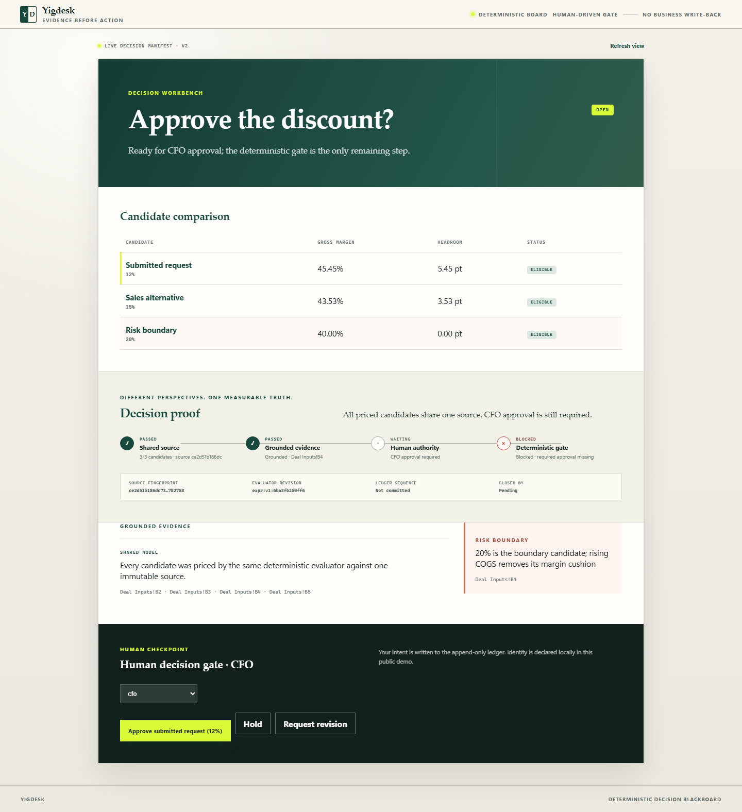
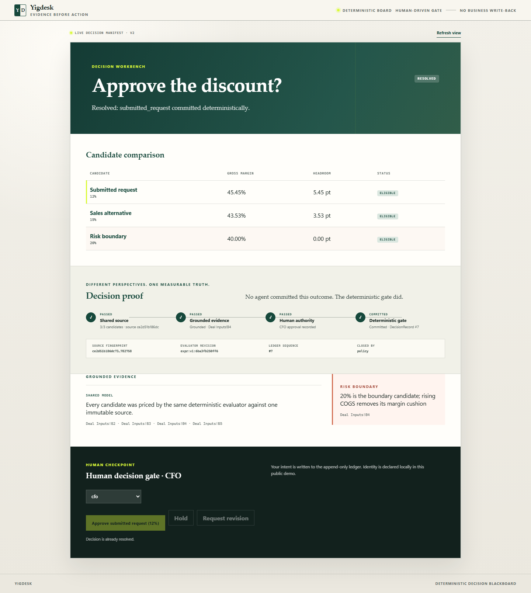

# Yigdesk

**Different agents. One measurable truth.**

Yigdesk is a Codex-native decision workbench where Finance, Sales, and Risk can
reason differently without creating different numerical realities. Each
specialist proposes a structured candidate or grounded claim; the same
deterministic engine prices every option; a human records the contextual intent;
and a deterministic gate — never a language model — commits the final decision.



## OpenAI Build Week 2026

- **Track:** Work & Productivity
- **Audience:** cross-functional finance, commercial, operations, and approval teams

The Northwind acceptance journey turns one discount request into a real Codex
workflow:

1. A Codex orchestrator opens one decision on the six-operation MCP blackboard.
2. GPT-5.6 Finance, Sales, and Risk specialists run in parallel with different
   role instructions and allow-listed tools. Sales independently reprices the
   submitted request before adding its alternative.
3. The shared engine prices the 12%, 15%, and 20% options from the same
   generated-synthetic source; duplicate submitted-request analysis remains in
   the ledger but appears as one executive comparison row.
4. A read-and-claim-only optimizer mirrors the deterministic selector and posts
   one grounded, non-binding advisory after the specialists finish.
5. The browser renders a versioned declarative decision manifest — never
   agent-authored HTML or JavaScript.
6. A human approves, holds, or requests revision through a typed, idempotent
   action envelope.
7. A ledger watcher resumes the active Codex workflow. Only the existing
   deterministic `request_resolve` gate can commit the `DecisionRecord`.

The strongest proof is the failure path: before approval, resolution returns
`pending("required approval missing")`; after the durable browser approval, the
same gate commits exactly one record. `npm run test:e2e` runs that complete
journey in a real browser, including unsafe-action rejection.

### Decision Proof — the visible technical core

The `yigdesk-decision-view/v3` surface makes the trust boundary legible as one
four-stage proof: **Shared source → Grounded evidence → Human authority →
Deterministic gate**. It moves from blocked, to ready, to a committed
`DecisionRecord` while exposing the source fingerprint, evaluator revision, and
ledger sequence. It also exposes the frozen input cutoff and the count of
identity-bound agent contributors. Writes that land after cutoff are visibly
audited and excluded. The aha moment is concrete: **no agent committed the outcome;
the deterministic gate did.**



### What was extended during Build Week

| Existing foundation | Build Week extension |
| --- | --- |
| Append-only deterministic blackboard | Real Codex council with three parallel specialists and one bounded optimizer |
| Six MCP operations | Fast-path plugin and live, identity-bound frontend launcher |
| Deterministic pricing and resolution | Adaptive allow-listed manifest, focused renderer, and Decision Proof |
| Human approval operation | Typed AgentAction bridge with durable idempotency |
| Local board polling | Honest ledger-backed Codex continuation adapter |
| Backend conformance tests | Full Northwind browser journey from fail-closed to committed record |

This public submission intentionally uses one owner coordinating subagents. It
does **not** claim multi-tenant identity, a private native Codex callback,
production connectors, workbook write-back, or arbitrary Excel compatibility.
Those are future integration boundaries, not simulated capabilities.

## How it works

Yigdesk is a standalone service where autonomous agents and human reviewers
decide *together* on a shared, append-only board. Agents propose candidate
actions and post grounded claims; a pluggable evaluator prices every candidate
from source data; humans (or a policy) approve; and a deterministic gate closes
the decision and commits an auditable record.

The whole system is three small parts:

- an **append-only ledger** of operations (the board is a pure fold of this log);
- a **pluggable, model-from-data evaluator** that prices actions and grounds claims;
- an **MCP-native surface** of six operations that agents and orchestrators call.

Nothing writes back to the source model. The ledger *is* the audit trail, and the
committed `DecisionRecord` is the outcome.

## The six board operations

The entire agent-facing surface is six operations (`yigdesk/blackboard_mcp.py`).
The four direct mutations append one immutable op, `read_board` is a pure
projection, and a successful `request_resolve` appends the committed `resolved`
record (`pending` appends nothing):

| Op | Who calls it | Effect |
| --- | --- | --- |
| `open_decision` | orchestrator / owner | Opens a decision with a question, type, and policy. |
| `propose_candidate` | proposer agent | Submits input overrides; the engine **prices** the candidate deterministically. |
| `post_claim` | critic agent | Posts a typed claim; **rejected fail-closed** unless every ref grounds to real evidence. |
| `cast_approval` | reviewer / human | Records an `approve` / `hold` / `reject` verdict scoped to a candidate or the decision. |
| `request_resolve` | resolver | Runs the deterministic gate → `pending(reason)` or a committed `DecisionRecord`. |
| `read_board` | anyone | Returns the deterministic board projection. |

Roles are separated on purpose: proposer/critic agents only propose and claim;
opening, approving, and resolving stay with the orchestrator or human. A role
agent can never close a decision — only the gate can.

## Determinism guarantees

Yigdesk is built so that the same inputs always produce the same board and the
same outcome. Four guarantees are enforced by code and pinned by
`tests/test_determinism_conformance.py`:

- **D1 — deterministic pricing.** A candidate's consequence is a pure function of
  its action and the source. `ExpressionEvaluator` evaluates a data-defined model
  (metrics, formulas, constraints) over exact `Decimal` arithmetic with fixed
  rounding — no floats, no ambient state. The same action always prices identically.
- **D2 — state is a pure fold.** The board is `fold(ledger)` over the append-only
  op log (`yigdesk/core/projection.py`). Replaying the same ledger yields a
  byte-identical projection every time.
- **D3 — grounding fails closed.** `post_claim` is accepted only when *every*
  reference resolves to a real evidence cell; an ungrounded claim is recorded as
  `rejected` and never enters the projection. The gate refuses to resolve a
  decision whose policy requires a grounded claim that is absent.
- **D4 — deterministic resolution.** `request_resolve` (`yigdesk/core/gate.py`) is
  a pure function of the candidates, approvals, policy, and evaluator revision. It
  returns `pending(reason)` or commits a `DecisionRecord`; no language model
  decides the close.

## Scenarios and the council app

A **scenario** is a domain app: a directory with a `model.json` (the evaluator
model: input cell refs, metrics, formulas, constraints), a `policy.json` (required
approvals, required claims, candidate selector), and a synthetic workbook holding
the source cells. Three ship in `data/scenarios/`:

- **`discount_approval`** — should a discount be approved under a gross-margin
  floor? Requires a CFO approval; selects the surviving candidate with the most
  headroom (`max:headroom`).
- **`saas_margin`** — does a plan hold a target margin after expansion? Requires a
  VP-Finance approval; selects on `max:headroom`.
- **`council_discount`** — the flagship multi-agent app. Same discount question,
  but the policy additionally requires a **grounded `risk` claim** before the gate
  will resolve. Four Codex personas (`.codex/agents/`) work the board over the six
  ops in two stages, coordinated by the `yigdesk-council` skill (`.agents/skills/`):
  - `finance_analyst` — prices the submitted discount as a candidate;
  - `sales_advocate` — independently prices the submitted discount and one distinct customer-friendly alternative;
  - `risk_challenger` — prices a boundary candidate and posts a grounded `risk` claim on the COGS cell;
  - `decision_optimizer` — reads the completed specialist board and posts one grounded, non-binding advisory claim.

The optimizer cannot propose, approve, or resolve. The orchestrator (or human)
casts the approval and calls `request_resolve`; the deterministic gate closes the
decision.

## Quickstart

Requirements: Python 3.11+ (and Node.js 20+ only for the Playwright end-to-end
tests). Everything is local and synthetic; no external credential is needed to run
the blackboard, the evaluator, or the web board.

```bash
python -m pip install -e .
python scripts/build_scenarios.py        # materialize each scenario's workbook
python -m pytest                          # run the full test suite
```

### 60-second judge preview

Seed the same three-option, four-agent synthetic decision used by the browser test,
then open <http://127.0.0.1:8787>.

```powershell
python -m scripts.seed_board --scenario data/scenarios/council_discount --ledger runtime/judge-board.jsonl
$env:YIGDESK_SCENARIO="data/scenarios/council_discount"
$env:YIGDESK_LEDGER="runtime/judge-board.jsonl"
python -m yigdesk.app
```

On macOS/Linux, set the two environment variables inline before
`python -m yigdesk.app`. To verify the entire failure-to-commit journey rather
than only viewing the seeded surface, run `npm run test:e2e`.

Run the **MCP server** so an agent client (or MCP Inspector) can call the six ops.
It reads `YIGDESK_SCENARIO` (the scenario directory to price against, default
`data/scenarios/council_discount`)
and `YIGDESK_LEDGER` (the append-only board ledger, default `runtime/board.jsonl`):

```bash
YIGDESK_SCENARIO=data/scenarios/discount_approval python -m yigdesk.blackboard_mcp
```

### ChatGPT App (Developer Mode)

The same Python MCP server now exposes a versioned MCP App component without
adding a seventh tool. `read_board` opens the focused decision workbench;
component actions call `cast_approval` with durable idempotency metadata; only
`request_resolve` can commit the `DecisionRecord`. Start the Streamable HTTP
endpoint on a separate port:

```powershell
$env:YIGDESK_SCENARIO="data/scenarios/council_discount"
$env:YIGDESK_LEDGER="runtime/chatgpt-board.jsonl"
$env:YIGDESK_MCP_HOST="0.0.0.0"
$env:YIGDESK_MCP_PORT="8788"
python -m yigdesk.blackboard_mcp --transport streamable-http
```

The app endpoint is `http://127.0.0.1:8788/mcp`. Inspect it locally with the
[MCP Inspector](https://developers.openai.com/apps-sdk/deploy/testing/), then
expose port `8788` through an HTTPS development tunnel. In ChatGPT, enable
Developer Mode under **Settings → Apps & Connectors → Advanced settings**, create
an app with `https://<your-tunnel-host>/mcp`, and refresh the app whenever tool or
resource metadata changes. The official connection flow is documented in
[Connect from ChatGPT](https://developers.openai.com/apps-sdk/deploy/connect-chatgpt/).

This repository deliberately remains a synthetic, unauthenticated Developer
Mode demo. The selected CFO/reviewer role is recorded attribution, not verified
identity; production or multi-tenant use requires an external OAuth and tenant
adapter rather than weakening the six-op blackboard boundary.

Bind a synthetic upload into an **immutable session** (the offline intake path;
generate a sample first with `python -m scripts.generate_sample_workbook`):

```bash
python -m yigdesk.cli bind --file runtime/northwind-fy2024-synthetic.xlsx --discount 2 --floor 30
python -m yigdesk.cli state
```

Binding verifies and preserves an upload, but the live board still prices the
scenario selected by `YIGDESK_SCENARIO`; upload-to-board selection is a separate
future integration.

Serve the **web board + human gate** on <http://127.0.0.1:8787>. It reads the
same scenario and ledger as the MCP server, renders candidates, grounded claims,
approvals, and committed records. The policy-aware gate shows one approval for a
`max:headroom` outcome; a Codex task can then observe that durable action and call
the deterministic resolver:

```bash
YIGDESK_SCENARIO=data/scenarios/council_discount YIGDESK_LEDGER=runtime/board.jsonl python -m yigdesk.app
```

For the fast Codex council, start an identity-bound unseeded frontend. The
launcher requires both `/api/health` and `/api/board` to return HTTP 200 within
10 seconds and writes an atomic ready receipt:

```bash
python -m scripts.council_frontend --decision-id northwind-demo \
  --ready-file runtime/council-frontends/northwind-demo.json
```

While the same Codex task remains active, its ledger watcher resumes after the
human button action. Approval runs the existing deterministic gate; Hold is
terminal. Request revision keeps the input window open and re-enables human
actions only after a new priced candidate reaches the ledger:

```bash
python -m yigdesk.continuation --scenario data/scenarios/council_discount \
  --ledger runtime/board.jsonl --decision-id northwind-demo --after-seq 0 --timeout 60
```

### Codex plugin

The repository ships a Codex plugin at `plugins/yigdesk` plus a repo marketplace
at `.agents/plugins/marketplace.json`. The plugin bundles the fast council skill
and the same six-operation local MCP server; it does not depend on a private Codex
callback or add a seventh operation. After cloning and installing the Python
package, add the repo marketplace and install `yigdesk@yigdesk-local` with the
Codex plugin commands available in your Codex version. Start a new Codex task so
the newly installed skill and MCP server are loaded.

## Benchmark: bare agent vs. blackboard

`compare_agents` runs the same model twice on one case — once bare, once grounded
through the blackboard's priced candidate — and reports accuracy, determinism,
latency, and an observability score. It prices the `benchmark` scenario
deterministically as the independent reference. Both arms send the case to the
model, so the acknowledgement flag is mandatory:

```bash
python -m scripts.compare_agents --case benchmarks/case-template.json --runs 4 --acknowledge-data-sharing
```

`benchmarks/case-template.json` is a runnable template; for a real comparison, copy
it into the gitignored `benchmarks/private/` and replace it with your own
independently verified case and gold result. Reports are written under the ignored
`benchmark-results/` directory and contain only case id, verdict/metrics, latency,
token usage, source fingerprint, and tool names — never the raw case content.

## Documentation

- [Product and architecture specification](docs/YIGDESK_SPEC.md) — product thesis,
  deterministic guarantees and limits, Codex A2A, multi-tenant target, security,
  design system, feasibility, and value-ranked roadmap.

## License and rights

Files in this repository are licensed under Apache-2.0 (see [LICENSE](LICENSE)).
"Yigdesk" is a product identifier; the Apache License grants no right to use the
name, logo, or marks to identify or promote derived products (see [NOTICE](NOTICE)).

All people, organizations, messages, values, and workbook contents in this
repository are fictional and synthetic.
