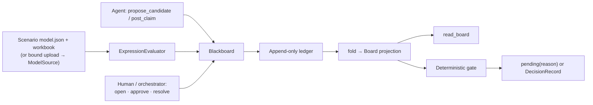

# Architecture

Yigdesk is a standalone deterministic decision blackboard, deliberately small
enough to audit end to end. Agents and humans decide together on a shared,
append-only board: agents propose and challenge, a data-defined evaluator prices
every candidate, and a deterministic gate — not a language model — commits the
outcome. The source model is read-only; the ledger is the audit.

The system is five units.

## 1. Blackboard Core — domain-neutral

`yigdesk/core/` knows nothing about any business domain. It is a ledger, a
projection, and a gate over generic decisions, candidates, claims, and approvals.

- **Ledger** (`core/ledger.py`) — an append-only operation log. A single writer
  assigns each op a monotonic `seq`; ops serialize to canonical JSON (sorted keys)
  so the log is byte-stable.
- **Ops** (`core/ops.py`) — the six op kinds and the `Op` record (`seq`, `kind`,
  `actor`, `role`, `payload`, `base_seq`).
- **Projection** (`core/projection.py`) — `fold(ops) -> Board`, a pure left fold
  that rebuilds the whole board state from the log. Rejected (ungrounded) claims
  are dropped during the fold, so they never appear in state.
- **Gate** (`core/gate.py`) — `resolve(decision, revision, seq)`, a pure function
  that returns `Pending(reason)` or a committed `DecisionRecord`.
- **Model** (`core/model.py`) — the plain dataclasses (`Decision`, `Candidate`,
  `Claim`, `Approval`, `Consequence`, `Metric`, `DecisionRecord`, `Board`).
- **Blackboard** (`core/blackboard.py`) — the thin facade that wires the ledger to
  an evaluator and a source and exposes the six op methods.

## 2. Evaluator — pluggable, model-from-data

`yigdesk/evaluator/` prices actions and grounds claims. It is a small `Evaluator`
protocol (`base.py`: `price`, `ground`, `revision`), so a domain swaps the model,
not the code.

- **`ExpressionEvaluator`** (`evaluator/expression.py`) — the shipped evaluator.
  Its model is **pure data**: input refs, metrics, formulas, and constraints from a
  scenario's `model.json`. It evaluates formulas over exact `Decimal` arithmetic
  through a restricted AST (only `+ - * /` and unary minus), quantizes with fixed
  `ROUND_HALF_UP`, and derives its `revision` from a hash of the model — so a model
  change is a new revision.
- **`ModelSource`** (`evaluator/model_source.py`) — a read-only view of the source
  workbook: base input values from named cells, a SHA-256 fingerprint of the bytes,
  and `exists(ref)` for grounding. Constraints are decided on exact unrounded
  values, never on display rounding.

A candidate is priced into a `Consequence` (verdict `ok`/`hold`, per-metric
before/after values, the evidence refs, and the source fingerprint). Missing inputs
or a violated constraint yield `hold`.

## 3. MCP Surface — six operations

`yigdesk/blackboard_mcp.py` exposes the board as an MCP service (`FastMCP`,
stdio). The entire agent-facing surface is six tools, one per op:

| Op | Effect |
| --- | --- |
| `open_decision` | Open a decision with question, type, and policy. |
| `propose_candidate` | Price a candidate (input overrides) deterministically. |
| `post_claim` | Post a typed claim; rejected fail-closed unless every ref grounds. |
| `cast_approval` | Record an `approve` / `hold` / `reject` verdict. |
| `request_resolve` | Run the gate → `pending(reason)` or a committed record. |
| `read_board` | Return the deterministic board projection. |

The server reads two environment variables: `YIGDESK_SCENARIO` (the scenario
directory holding `model.json` and its workbook) and `YIGDESK_LEDGER` (the
append-only board ledger). There is no mutation, write-back, authorization,
signing, vault, audit-service, or messaging surface.

## 4. Human / Board bridge

Roles are separated so a proposer or critic can never close a decision:

- proposer/critic agents call only `propose_candidate` and `post_claim`;
- `open_decision`, `cast_approval`, and `request_resolve` stay with the
  orchestrator or a human reviewer.

The bridge is the policy read by the gate. A policy names its
`required_approvals`, its `required_claims`, and a `candidate_selector`:

- `human_selected` — the gate closes only on a candidate a human explicitly
  approved (by scope), and never on a `hold` candidate;
- `max:<metric>` — the gate picks the eligible candidate that maximizes a metric.

Either way the close is deterministic and the committed `DecisionRecord` names the
chosen candidate, who closed it (`human` or `policy`), the evidence refs, the
evaluator revision, and the source fingerprint.

## 5. Domain App — data plus config

A domain lives entirely in data and configuration:

- **Scenarios** (`data/scenarios/<name>/`) — `model.json` (evaluator model),
  `policy.json` (approvals, required claims, selector), and a synthetic workbook.
  `scripts/build_scenarios.py` materializes the workbooks.
- **Council personas** (`.codex/agents/`) and the **`yigdesk-council` skill**
  (`.agents/skills/`) — the flagship domain app over `data/scenarios/council_discount`.
- **Web shell** (`yigdesk/app.py` + `yigdesk/static/`) — a minimal read-only
  evidence view (health, synthetic-workbook upload, static assets). It owns
  upload/session binding only; it does not evaluate the model or expose the board.

## Op and data model

Every board mutation is one ledger op; state is the fold of those ops.

- `open_decision` → a `Decision` (id, question, type, policy).
- `propose_candidate` → a `Candidate` carrying its priced `Consequence`.
- `post_claim` → a `Claim` (`grounded` or `rejected`); only grounded claims fold in.
- `cast_approval` → an `Approval` (actor, role, verdict, scope).
- `request_resolve` → a `DecisionRecord`, appended as a `resolved` op, marking the
  decision closed.

## Determinism (D1–D4)

Pinned by `tests/test_determinism_conformance.py`:

- **D1 — deterministic pricing.** A consequence is a pure function of action and
  source; the same action prices identically.
- **D2 — state is a pure fold.** `fold(ledger)` replays byte-identically.
- **D3 — grounding fails closed.** An ungrounded `post_claim` is rejected and never
  enters state; the gate refuses to resolve without a required grounded claim.
- **D4 — deterministic resolution.** `resolve(...)` is a pure function of
  candidates, approvals, policy, and revision — no language model closes a decision.

## Reuse: uploaded workbook as a source

The offline intake path (`yigdesk/importer.py`, `yigdesk/session.py`,
`yigdesk/cli.py`) validates and binds a synthetic upload into an immutable session
whose bytes are re-verified against a recorded fingerprint. The
`source_for_active_session` adapter (`evaluator/session_source.py`) wraps that
bound session's projection workbook as a `ModelSource`, so the same evaluator that
prices a packaged scenario can price an uploaded one — no second parser, no writes.

