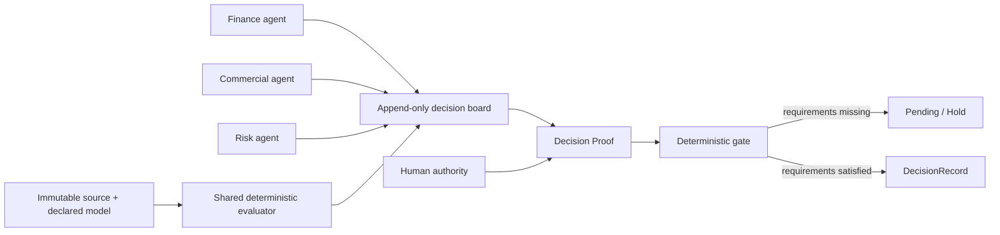

# Yigdesk product and architecture specification

**Status:** living specification
**Audience:** product judges, technical evaluators, engineering leaders, and contributors
**Reference release:** public synthetic Northwind council demo
**North star:** different perspectives, one measurable truth

## 1. Product definition

Yigdesk is an agent-native decision workbench. It lets agents with different
roles, instructions, skills, and memory explore a decision independently while
forcing every material proposal through one measurable environment. Agents
create possibilities and challenges. A deterministic engine calculates their
consequences. A human supplies accountable intent. A deterministic gate alone
commits the outcome.

The product is not an agent chat room, a spreadsheet copilot, or a workflow
builder with an AI label. It is a **deterministic membrane** between probabilistic
reasoning and consequential action:

The current public demo proves this architecture with one Codex owner and
role-bound subagents. The target product extends the same protocol to main agents
owned by different tenants without changing the calculation or resolution
semantics.

## 2. The problem it solves

Direct agent-to-agent discussion is useful for discovering options, but it is a
weak system of record for business decisions. Agents can:

- use different implicit definitions for the same metric;
- copy or round figures differently across turns;
- lose source provenance as a conversation grows;
- converge socially on a persuasive answer without satisfying policy;
- state that an action was approved or completed when no durable transition
  occurred;
- reproduce the prose while failing to reproduce the calculation.

Yigdesk preserves the creative advantage of different agents while removing the
need to trust their arithmetic or their account of what happened. The agents do
not need to agree. They need to submit comparable candidates and grounded claims.
The engine normalizes those contributions into consequences calculated from the
same source, model revision, precision rules, and constraints.

This is why Yigdesk can produce a stronger result than a free-form council:

| Free-form agent council | Yigdesk decision room |
| --- | --- |
| Shared language, potentially different math | Different language, exactly one calculation contract |
| Evidence is quoted or summarized | Evidence references must resolve to real source cells |
| Approval is conversational | Human intent is a typed, durable operation |
| Closure can be asserted by an agent | Only the deterministic gate can commit |
| Reproduction depends on prompts and chat history | Reproduction depends on immutable source, model revision, policy, and ledger |

The engine does not make the agents smarter. It makes their disagreement
measurable, their conclusions comparable, and their final transition auditable.

## 3. The product's aha moment: Decision Proof

The focused browser view turns the architecture into a visible proof, not a
backend claim. Every live decision has a four-stage rail:

1. **Shared source** — every priced candidate carries the same immutable source
   fingerprint.
2. **Grounded evidence** — the required typed claims exist and all references
   resolve.
3. **Human authority** — the policy-required role has recorded one terminal
   intent.
4. **Deterministic gate** — the decision is blocked, ready, terminal, or committed
   by an immutable `DecisionRecord`.

Before approval, the first two stages can pass while the gate visibly refuses to
continue. After approval, the same decision becomes ready. After resolution, the
surface exposes the committed ledger sequence, source fingerprint, evaluator
revision, and closer. The executive conclusion is deliberately explicit:

> No agent committed this outcome. The deterministic gate did.

This transition is the product's core demonstration of trust. A successful path
alone could be simulated. A fail-closed path followed by one authorized,
reproducible commit cannot.

## 4. Current reference journey

The synthetic Northwind decision asks whether a submitted discount should be
accepted while preserving a gross-margin floor.

1. The orchestrator opens one decision with a policy requiring CFO approval and
   a grounded risk claim.
2. A Finance agent prices the submitted 12% discount.
3. A Commercial agent independently prices the same 12% request and then a 15%
   customer-friendly alternative.
4. A Risk agent prices a 20% boundary candidate and grounds its challenge to the
   declared COGS source cell.
5. All four proposals are calculated by the same engine. The duplicate 12%
   analysis remains attributable in the ledger while the focused view shows the
   three distinct 12% / 15% / 20% options with gross margin and headroom.
6. A non-binding optimizer then mirrors the deterministic selector and posts one
   grounded advisory claim, but cannot propose, approve, or resolve.
7. The human approves, holds, or requests revision in the browser.
8. A continuation adapter observes the durable intent. Approval invokes the
   existing resolver; Hold is terminal. Request revision keeps the input window
   open and requires a new priced candidate before another human action.
9. The gate either returns a precise pending reason or appends one
   `DecisionRecord`.

The personas never impersonate one another and never simulate dialogue. They
interact by writing typed operations to the same board.

## 5. Core architecture

### 5.1 Domain-neutral blackboard

The blackboard core models decisions, candidates, consequences, claims,
approvals, and committed records. It contains no Northwind, sales, finance, or
spreadsheet-specific behavior.

Its state is a pure fold of an append-only operation ledger. Each operation has a
monotonic sequence, actor, role, payload, and base sequence. Invalid late
operations cannot alter a committed decision.

#### 5.1.1 Durable agent identity in the public reference

Every MCP agent writer is bound to `yigdesk-agent-identity/v1` by its project or
plugin process configuration, not by model-supplied tool arguments. The envelope pins:

- stable `agent_id` and profile;
- a caller-supplied shared council `run_id` (falling back to the unique MCP
  process `instance_id` when no run correlation is supplied);
- declared model plus prompt, skill, and memory revision identifiers;
- `assurance=local_config_declared`.

The envelope is allow-listed, length-bounded, and copied into each accepted
agent operation. Candidate and claim projections retain it, and the committed
DecisionRecord contains the unique identities that contributed to the frozen
input set. The manifest exposes the declared contributor count while the board
projection retains the complete envelopes. No prompt or memory content is
copied to the shared board.

This is durable provenance, not production authentication. A local process that
can change its environment can declare another identity. A hosted beta must
replace this adapter with verified service-agent and tenant claims while keeping
the versioned ledger shape. The public repository intentionally adds no signing,
authorization, vault, or identity service.

#### 5.1.2 Atomic input cutoff and late-write protocol

The first approving or holding `cast_approval`, or the first
`request_resolve`, establishes an immutable per-decision `cutoff_seq` while the
ledger transaction lock is held. Request revision does not establish a cutoff,
so an agent may still submit the requested replacement candidate.

Candidate and claim operations are ordered by the same transaction lock:

- a write allocated before the cutoff is part of the gate input;
- a write that started earlier but obtains the lock after the cutoff is appended
  under its original operation type with `status=late_rejected`, its observed
  cutoff, identity, and rejection reason;
- projection exposes the rejected attempt as `late_writes` but never inserts it
  into candidates or grounded claims;
- the caller receives a precise error naming both cutoff and audit sequence;
- resolution pins the same cutoff in the DecisionRecord.

This prevents timing-dependent changes between specialist completion, human
approval, and deterministic resolution. It also makes a race visible instead of
silently dropping it. The protocol reuses `cast_approval` and
`request_resolve`; no seventh MCP operation or alternate close path exists.

### 5.2 Pluggable evaluator

The evaluator contract has three responsibilities:

- price a structured candidate against a read-only source;
- ground a reference against the same source namespace;
- expose a stable evaluator revision.

The shipped expression evaluator loads inputs, metrics, formulas, constraints,
and rounding rules from scenario data. It uses exact decimal arithmetic and a
restricted expression grammar. Scenario logic lives in data rather than in the
blackboard core.

### 5.3 Six-operation agent surface

The six operations are the complete agent-facing protocol:

| Operation | Responsibility |
| --- | --- |
| `open_decision` | Create the decision question and policy. |
| `propose_candidate` | Submit structured input overrides; the engine prices them. |
| `post_claim` | Submit a typed claim; reject it unless every reference grounds. |
| `cast_approval` | Record approve, hold, or reject intent under a required role. |
| `request_resolve` | Run the deterministic gate and return pending or commit. |
| `read_board` | Return the current projection of the append-only ledger. |

There is no seventh operation for the browser, optimizer, or continuation
adapter. All routes converge on these same semantics.

### 5.4 Declarative decision view

The browser consumes `yigdesk-decision-view/v3`, a versioned allow-listed
manifest. Its trusted blocks are comparison, proof, evidence, warning, actions,
and secondary history. The manifest can control hierarchy, copy, metrics,
evidence, and contextual actions, but cannot carry HTML, JavaScript, URLs, or an
arbitrary component.

The renderer creates DOM nodes with text content and owns security,
accessibility, responsive behavior, and the Evidence Ledger visual language.
This preserves adaptive composition without turning agent output into executable
UI.

### 5.5 Typed human intent

Browser actions use the allow-listed `yigdesk-agent-action/v1` envelope. It
contains the decision, candidate or scope, action type, human role and verdict,
plus action and correlation identifiers.

The bridge validates the whole envelope and current policy before reusing
`cast_approval` or `request_resolve`. Both operations persist the action and
correlation identifiers in their existing ledger operation, so idempotency
survives a web-process restart. Replaying an identifier succeeds only when the
entire request is identical. A different second terminal action is rejected
instead of silently changing history. A revision rejection is the exception:
another human action becomes valid only after a later priced candidate proves
that a new measurable round exists.

### 5.6 DecisionRecord as the close

A committed record includes the chosen candidate, closing rule, evidence
references, source fingerprint, evaluator revision, input cutoff, declared
contributor identities, and ledger sequence. The
append-only ledger and the record are the audit trail. There is no separate
attestation service in the public repository.

## 6. What is deterministic today

“Deterministic” is intentionally scoped to code paths that can be reproduced and
tested. It does not describe an agent's prose, preference, or choice of candidate.

### D1 — Candidate pricing

For a fixed evaluator revision, source fingerprint, candidate action, precision,
and rounding rule, pricing yields the same metrics, constraint verdict, evidence
references, and serialized consequence.

### D2 — Board projection

Replaying the same ordered ledger produces the same board projection. The log is
append-only and canonically serialized. The fold establishes the first cutoff,
excludes all post-cutoff candidate and claim writes, and projects their rejection
receipts separately.

### D3 — Evidence grounding

A claim is accepted only when every declared reference exists in the active
source namespace. A partially grounded claim fails closed and never satisfies a
policy requirement.

### D4 — Resolution

The gate is a pure function of candidates and grounded claims present at the
input cutoff, approvals, policy, and evaluator revision. Candidate selection
uses declared rules and deterministic tie-breaking. The result is either
`pending(reason)` or one committed record that pins the cutoff and declared
contributor identities.

### D5 — Human action replay

Action identifiers are durable. Exact retries return the original consequence;
conflicting reuse or a different terminal action is rejected.

### D6 — Source immutability

Pricing and grounding read a fingerprinted source. The engine never writes the
source workbook or model. Session binding verifies preserved bytes before an
adapter can use them.

These guarantees do **not** mean that two agents will propose the same candidate,
that an LLM response is reproducible, or that every possible spreadsheet formula
is supported.

## 7. Calculation scope and limitations

The current evaluator is general within a deliberately small mathematical
language. The flagship scenario happens to calculate sales discount, gross
margin, and headroom; those concepts are scenario data, not hard-coded engine
features. The same evaluator already supports other algebraic financial models
when their inputs, formulas, constraints, units, precision, and rounding are
declared.

Serious limitations remain:

- the expression grammar covers deterministic arithmetic, not the full Excel
  function language;
- it has no built-in time-series engine, cash-flow calendar, tax rules, currency
  market data, probability distributions, or optimization solver;
- statistical significance requires explicit assumptions about sampling,
  missing data, estimators, confidence levels, and random seeds;
- scientific computation requires declared units, constants, numerical methods,
  tolerances, and library versions;
- a deterministic calculation can still be invalid if its model or input data is
  wrong.

The correct response is not to make one formula parser pretend to cover every
domain. Yigdesk should support evaluator providers behind the same contract:

| Provider class | Appropriate use | Reproducibility requirements |
| --- | --- | --- |
| Restricted expression evaluator | Margins, ratios, thresholds, scoring, simple forecasts | Decimal precision, fixed rounding, model hash |
| Spreadsheet compatibility adapter | Existing workbook logic with supported functions | Frozen workbook bytes, calculation version, locale/date settings, explicit unsupported-function failure |
| Statistical evaluator | Experiments, forecasts, risk distributions | Dataset fingerprint, method/version, missing-data policy, fixed seed where randomization exists |
| Scientific evaluator | Units, domain equations, simulations | Unit system, constants, solver/library version, tolerance, convergence rule |
| Optimization evaluator | Allocation, scheduling, portfolio constraints | Solver/version, objective, constraints, bounds, tolerance, deterministic tie-break |

A larger spreadsheet compatibility module could materially deepen Yigdesk, but it
should be integrated as an evaluator adapter rather than copied into the core.
Direct reuse is safe only after its dependency graph, formula coverage, volatile
functions, external links, locale behavior, precision, error semantics, and
licensing are independently verified. Unsupported formulas must fail closed;
silent fallback would weaken the product's central claim.

## 8. How Codex A2A works

### 8.1 Current demo: one owner, multiple subagents

The orchestrating Codex task owns the decision lifecycle. It creates role-bound
subagents with different:

- system and task instructions;
- allow-listed blackboard tools;
- skills and domain procedures;
- working context and local memory;
- responsibility for proposing or challenging, never closing.

Their outputs become typed board operations. The shared ledger, source,
evaluator, and policy provide the common environment. This is genuine
agent-to-agent coordination through shared state, even though the subagents have
one owner and do not have independent tenant identity.

Different memory is valuable for hypothesis generation, but it is never accepted
as numerical evidence. If a remembered fact matters, the agent must ground it to
the active source or state it as an advisory claim that cannot satisfy the gate.

### 8.2 Target product: multiple tenants, main agents

In the target architecture, a CFO, COO, and Commercial Director can each operate
their own main Codex agent. Each organization controls its agent instructions,
skills, memory, and model policy. A Yigdesk decision room supplies only the shared
contract:

- immutable source snapshot and semantic model;
- tenant-scoped decision and candidate identifiers;
- evaluator revision and policy;
- role-authorized operations;
- append-only, causally ordered events;
- safe view manifest and action envelope;
- deterministic resolution and shared record.

Agents exchange claims and candidate consequences through the room rather than
sharing private prompts or private memory. This creates collaboration without
requiring one tenant to reveal its entire agent context to another.

### 8.3 Why board-mediated interaction is better

Direct messages can remain a discovery channel, but they are non-authoritative.
The board is superior for the decision path because it supplies typed semantics,
shared measurements, durable causality, policy enforcement, idempotency, and an
objective terminal condition. A persuasive message cannot override a failed
constraint, missing approval, or missing evidence.

## 9. Native ChatGPT and Codex integration boundaries

### 9.1 ChatGPT App implementation

Yigdesk is an `interactive-decoupled` MCP App. It does not iframe the Flask site
or allow an agent to send executable UI. The Python MCP server exposes one
versioned resource, `ui://yigdesk/decision-workbench-v1.html`, with MIME type
`text/html;profile=mcp-app`. ChatGPT hosts that trusted bundle in its component
sandbox. The bundle has an empty network/resource CSP and no external scripts,
styles, frames, or direct HTTP access.

The six-operation surface remains unchanged:

- `read_board` is the primary render entry and returns both the original board
  projection and the validated `yigdesk-decision-view/v3` manifest;
- `open_decision`, `propose_candidate`, and `post_claim` remain model-facing data
  operations and do not mount a new component;
- the mounted component calls `cast_approval` through the MCP Apps `tools/call`
  bridge with action, correlation, candidate, role, and verdict metadata;
- `request_resolve` is the final render event and remains the only operation that
  can ask the deterministic gate to append a committed record.

Every result contains a monotonic ledger-backed `stateVersion` and a typed event.
The agent-compatible top-level `decisions` projection is preserved, while `view`
contains only allow-listed copy, metrics, evidence, warnings, proof, history, and
contextual actions. Component code renders these values through DOM `textContent`
and treats host-delivered structured content as untrusted input.

After a human action, the component refreshes from the tool result and emits a
standard `ui/message` user continuation. Approval asks ChatGPT to read the new
state and call `request_resolve`; Hold explicitly forbids resolution; Request
revision asks for a new measurable proposal. This is real host continuation, not
a simulated private callback. The optional `window.openai` path is compatibility
and fullscreen support; baseline communication uses the portable JSON-RPC MCP
Apps bridge.

For local ChatGPT testing the server supports Streamable HTTP at `/mcp` as well
as the existing `stdio` transport used by Codex. A public HTTPS development
tunnel can connect the endpoint to ChatGPT Developer Mode. Public distribution
is intentionally out of scope: customer-specific writes require OAuth, verified
tenant identity, hosted infrastructure, and submission metadata that this public
synthetic repository is contractually forbidden to pretend it has.

### 9.2 Native Codex continuation boundary

The public repository does not have a private native callback that can resume any
Codex task after a browser click. It therefore exposes a clean continuation
adapter and an honest local watcher:

- the browser writes structured human intent to the ledger;
- an active Codex workflow watches the same ledger;
- approval invokes the existing deterministic resolver;
- Hold returns a terminal outcome;
- Request revision returns control to the agent workflow, while the action gate
  remains locked until a new priced candidate lands;
- the refreshed view explains exactly what happened and what is needed next.

A native production integration would replace only the notification/continuation
adapter. It must preserve the action envelope, correlation and idempotency
metadata, tenant identity, six-operation surface, and deterministic gate. It must
not call a hidden close path.

## 10. Multi-tenant target architecture

The public demo is not yet a multi-tenant service. A credible internal or public
beta requires the following control-plane and data-plane capabilities.

### Control plane

- organization, workspace, user, service-agent, and role identity;
- tenant-scoped policy and agent registry;
- model, prompt, skill, and memory-version references without exposing private
  contents across tenants;
- invitation, membership, retention, deletion, and export controls;
- quotas, rate limits, abuse controls, and operational administration.

### Decision data plane

- durable transactional event store with per-decision ordering and idempotency;
- immutable versioned source objects and semantic models;
- isolated evaluator workers with resource limits;
- asynchronous continuation queue and delivery receipts;
- live subscriptions for browser and agent clients;
- encrypted tenant boundaries, backup, restore, and disaster-recovery tests;
- tamper-evident exports of the ledger and committed record.

### Trust boundary

- authorization on every read and write, not only in the browser;
- role binding proven by identity rather than a locally declared demo role;
- source and memory isolation between tenants;
- no agent-supplied scripts, unsafe HTML, source mutation, or unapproved
  production connectors;
- evaluator sandboxing and explicit egress policy;
- complete correlation from agent invocation to operation to record.

The domain-neutral blackboard and evaluator contracts can remain. The local JSONL
ledger, declared demo identity, and polling continuation are replaceable adapters,
not beta-grade infrastructure.

## 11. Security and failure semantics

Yigdesk treats uncertainty as a state to expose rather than a reason to improvise.

- Unknown manifest blocks, fields, statuses, and action types are rejected.
- Agent strings are rendered as text, never executable markup.
- Missing or false evidence cannot satisfy a policy.
- Missing role approval returns a precise pending reason.
- A held candidate cannot be selected.
- Conflicting idempotency keys are rejected.
- A decision cannot be reopened or mutated after its committed record.
- The source is read-only and fingerprinted.
- Development identity, callbacks, and connectors are never presented as
  production guarantees.

For a hosted beta, the threat model must additionally cover tenant spoofing,
cross-tenant data disclosure, prompt/tool injection, confused-deputy actions,
replay across workspaces, evaluator denial of service, malicious source files,
secrets in evidence, and compromised continuation endpoints.

## 12. Technical differentiation and potential impact

The defensible core is the combination, not any single component:

1. **Plural intelligence, singular measurement.** Organizations keep specialized
   agents instead of collapsing them into one generic assistant.
2. **Decision-native protocol.** Candidate, claim, approval, and resolve are
   first-class operations rather than labels applied to chat messages.
3. **Visible refusal.** The browser proves why the system will not commit, making
   safety legible to a non-technical decision owner.
4. **Deterministic closure.** The final state is selected by declared policy over
   engine-priced consequences, never by an agent's confidence or eloquence.
5. **Portable proof.** Source fingerprint, model revision, evidence, human intent,
   and ledger sequence form a reproducible decision packet.
6. **Adaptive but safe UI.** Agents can influence the explanation without gaining
   executable control of the interface.

Potential impact grows with decision frequency and cross-functional friction.
The platform can reduce repeated spreadsheet reconciliation, shorten approval
cycles, preserve dissent as structured evidence, expose policy gaps before
execution, and turn institutional decisions into comparable records. It is most
valuable where several competent teams disagree because they optimize different
objectives, not because one of them lacks information.

## 13. Feasibility, difficulty, and engineering effort

The core architecture is feasible. The calculation and decision protocol are
already demonstrated. The difficult work is production trust, tenant isolation,
integration reliability, and expanding evaluator coverage without diluting the
determinism claim.

Estimates below assume a focused team, one cloud, one initial Codex integration,
and two or three supported decision domains. They exclude regulated-industry
certification and large connector catalogs.

| Stage | Outcome | Team and elapsed time | Approximate effort | Main risks |
| --- | --- | --- | --- | --- |
| Demonstrable vertical slice | One-owner subagent council, safe browser, durable local proof | Already implemented; 2–4 engineers for polish over 4–8 weeks | 4–10 person-months | Demo reliability, message clarity |
| Internal alpha | Authenticated single-organization pilots, managed persistence, observability, evaluator packaging | 5–7 people for 3–4 months | 18–28 person-months | Identity integration, migrations, task continuation |
| Private beta | Several isolated tenants, operational controls, two real domains, supportable deployment | 8–10 people for 5–7 months | 40–65 person-months | Isolation, source ingestion, evaluation correctness, on-call readiness |
| Public beta | Self-serve onboarding, quotas, abuse controls, recovery, privacy controls, measurable reliability | 10–14 people for 8–12 months | 80–130 person-months | Security, cost, support load, native platform dependencies |
| Enterprise GA | SSO/SCIM, retention/export, regional controls, formal assurance, connector governance | 14–22 people for an additional 9–15 months | 140–250 person-months | Compliance scope, procurement, connector blast radius |

The estimates can fall if Codex supplies stable native task continuation,
service-agent identity, and tenant-scoped tool authorization. They rise sharply
if Yigdesk must build those layers itself or promise broad spreadsheet
compatibility in the first beta.

## 14. Value-ranked roadmap

### P0 — Make the proof undeniable

- Decision Proof state rail from shared source to committed record;
- real fail-closed browser journey and unsafe-action rejection;
- reproducible demo seed and synthetic scenario;
- benchmark that compares a bare agent with the same agent using the board.

### P1 — Package reproducibility

- exportable decision packet containing model, policy, fingerprints, ordered
  operations, and record;
- one-command replay that verifies the same result;
- second acceptance scenario outside discount/margin to prove domain lift.

### P2 — Harden an internal alpha

- authenticated identities and role authorization;
- transactional event storage and immutable object storage;
- reliable continuation delivery and live subscriptions;
- evaluator worker isolation, observability, backup, and restore.

### P3 — Expand calculation depth carefully

- evaluator conformance kit;
- spreadsheet compatibility adapter with an explicit coverage report;
- deterministic statistics and optimization providers;
- semantic model/version registry and migration tooling.

### P4 — Multi-tenant A2A beta

- tenant-scoped main-agent participation;
- private prompt/skill/memory references with shared board outputs only;
- organization policy, quotas, retention, and audit export;
- native Codex continuation adapter when the platform contract is available.

## 15. Product and design principles

The interface should feel like a trusted editorial instrument, not a technical
monitoring dashboard. Warm archival surfaces carry ordinary content. Forest
marks structure and authority. Lime is reserved for proven or ready states.
Coral is reserved for refusal or risk. Monospace typography is used only for
proof identifiers and source references.

One active decision dominates the page. Historical decisions stay available but
secondary. Candidate comparison, grounded evidence, risk boundary, Decision
Proof, and contextual human actions form one reading order. Every disabled action
must explain the unmet policy requirement.

Accessibility and safety belong to the renderer: semantic tables, ordered proof
steps, visible focus, sufficient contrast, keyboard controls, responsive layout,
and reduced-motion behavior are not agent-configurable options.

## 16. Acceptance contract

A release is acceptable only when all of these remain true:

- exactly six blackboard operations are exposed;
- source workbooks and models remain unchanged;
- candidate pricing is deterministic under a pinned revision;
- ungrounded claims fail closed;
- policy requirements block resolution with precise reasons;
- only `request_resolve` can append a committed record;
- manifest and action validators reject unsafe or unknown payloads;
- repeated actions and resolution are idempotent;
- request revision permits another human verdict only after a new priced proposal;
- agent operations carry validated durable provenance without claiming authentication;
- approval or resolve establishes one atomic input cutoff;
- post-cutoff candidates and claims are audited but cannot change gate inputs;
- a write begun before cutoff but landed afterward is rejected deterministically;
- the browser proves blocked → ready → committed in a real journey;
- the Northwind example remains synthetic and the reusable client modules remain
  domain-neutral;
- full unit and browser suites pass before handoff.

## 17. Explicit non-goals of the public repository

The public reference does not provide production authorization, signing, vaults,
connectors, source write-back, arbitrary Excel compatibility, compliance
attestation, a separate audit service, or multi-tenant isolation. It does not
claim native Codex continuation where the runtime does not expose it. These are
product roadmap boundaries, not features to simulate.

## 18. Extension rule

To add a new decision domain, define its source contract, inputs, metrics,
formulas or evaluator provider, constraints, evidence namespace, policy, display
labels, and synthetic acceptance fixture. Do not add domain logic to the board,
client session, grid, model inspector, action bridge, or gate. If a domain needs a
new kind of mathematics, add an evaluator that passes the same determinism,
grounding, immutability, revision, and replay conformance contract.

That boundary is the long-term platform strategy: agents, domains, and
visualizations may multiply; the measurable contract stays singular.
